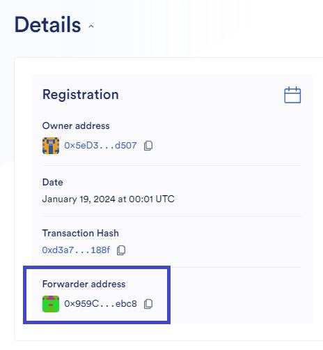
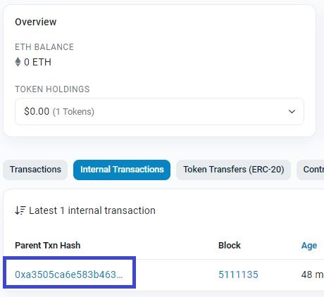
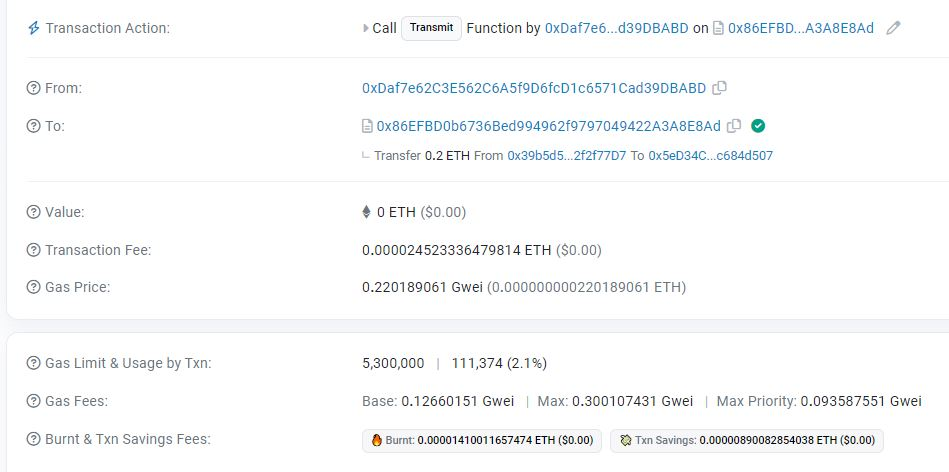

# Chainlink Automation Example

These are the steps for running the Chainlink automation example. This example uses the Sepolia testnet.

## Steps
### 1. Fund Your Accounts

1. Obtain [Sepolia](https://sepoliafaucet.com/) ETH (or whichever testnet you are using).
2. Obtain [LINK](https://faucets.chain.link/).

### 2. Deploy
```
npx hardhat run scripts/deploy.ts --network sepolia
```

### 3. Register Upkeep
Visit https://automation.chain.link/ and Register your upkeep.

1. Click "Register new Upkeep".
2. Select "Custom logic" trigger.
3. Enter the contract address you deployed.
4. Enter the name of your upkeep (ex. "Sepolia Vault Testing").
5. Enter the starting balance (ex. 1).

### 4. Find & Copy the Forwarder Address


### 5. Paste & Set Forwarder

1. Find the 2_setForwarder.ts script inside of scripts/automation/2_setForwarder.ts.
2. Update the FORWARDER_ADDRESS.
3. Copy your upkeep contract address (The Vault contract you deployed).
4. Update the VAULT_ADDRESS.
5. Call script.
```
npx hardhat run scripts/2_setForwarder.ts --network sepolia
```

### 6. Send ETH

1. Fine the 3_send.ts script inside of scripts/automation/3_send.ts.
2. Update the VAULT_ADDRESS.
3. Call script.
```
npx hardhat run scripts/3_send.ts --network sepolia
```

### 7. Observe
If successful, your upkeep should be called and the funds of the contract should be sent back to the owner of the Vault. The transaction should be an internal transaction if you are viewing your contract address on the block explorer.



## Extra Tips & Information

### Updating Gas Limit
If the gas limit set for your upkeep is too high, you can lower it. You can use the example transaction to get an idea of what the gas limit was:



### Understanding Fees
You can visit my [notion doc](https://glitchical.notion.site/Chainlink-Automated-Functions-b00708ab06234031b3ca45b60f08622b) page for an idea of how fees work. Obviously Chainlink's official documentation is the best for latest updates:

- https://docs.chain.link/chainlink-automation/overview/automation-economics